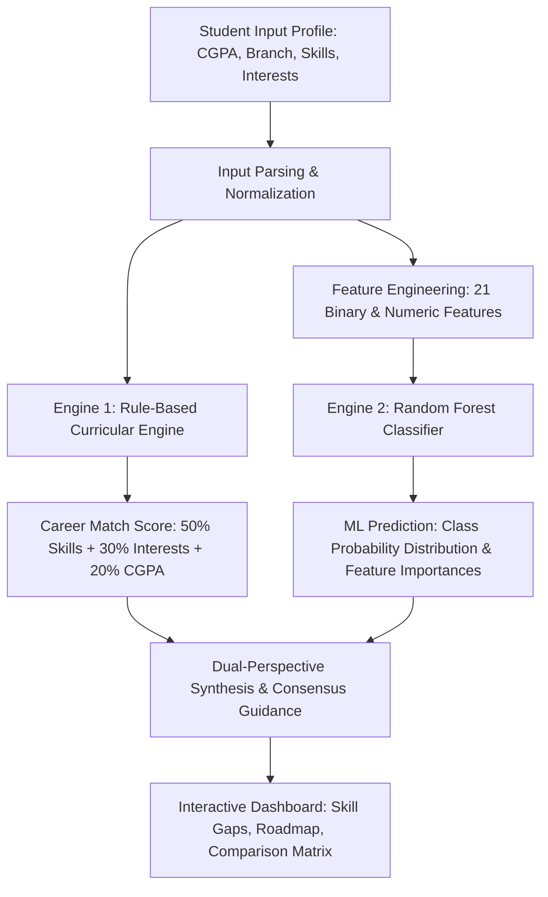

# SMART ACADEMIC AND CAREER INTELLIGENCE PLATFORM
**College Project-Based Learning (PBL) — Engineering Capstone**  
**Team:** G-2  
**Local Development URL:** `http://127.0.0.1:5000`  
**GitHub Repository:** [SMART-ACADEMIC-AND-CAREER-INTELLIGENCE-PLATFORM](https://github.com/mannolaakhil3-lang/SMART-ACADEMIC-AND-CAREER-INTELLIGENCE-PLATFORM)

---

## 📌 Executive Summary

The **Smart Academic and Career Intelligence Platform** is an intelligent, dual-engine academic advisory platform engineered by **Team G-2** for engineering undergraduates, academic mentors, and placement coordinators. 

The platform bridges the critical divide between collegiate academic curriculum and contemporary industry competency requirements. It ingests multidimensional student profiles—comprising academic standing (CGPA), branch of study, technical skills, soft skills, and domain interests—and synthesizes complementary guidance through two distinct systems:
1. **A Transparent, Deterministic Rule-Based Recommendation Engine:** Evaluates explicit curricular prerequisites, computes verified Career Match Scores (e.g., 88% Match), isolates prioritized skill gaps, and generates a structured 5-step roadmap.
2. **A Supervised Machine Learning Classifier (Random Forest):** Classifies student profiles into target career clusters, outputs statistical class probability distributions across candidate roles, highlights model feature importances, and reports generalization performance on held-out test splits.

Both engines operate side-by-side in a **Dual-Perspective Synthesis** dashboard, providing students with transparent decision support without confusing deterministic match scores with statistical model accuracy.

---

## 🎯 Problem Statement & Objectives

### Problem Statement
Undergraduate engineering students frequently encounter severe career trajectory disorientation due to:
1. **Curriculum-Industry Mismatch:** College syllabi often lag behind rapid advances in software, data, and security technologies.
2. **Role Ambiguity:** Students lack clear quantitative feedback on how their current skillset compares against prerequisites for roles such as Data Analyst, Software Developer, or AI/ML Engineer.
3. **Actionable Roadmap Deficit:** Traditional career portals recommend job titles without sequential, prioritized skill-acquisition milestones.
4. **Black-Box Skepticism vs. Statistical Rigor:** Rule-based tools can be rigid, while pure black-box deep learning or generative wrappers can hallucinate or fail to explain the rationale behind an advisory output.

### Project Objectives
- Ingest and normalize student academic credentials and skill vectors.
- Implement an auditable, deterministic rule-based evaluation engine for prerequisite checking.
- Train, evaluate, and persist a supervised `RandomForestClassifier` using `scikit-learn` to identify multivariate feature patterns across student profiles.
- Formulate a Dual-Perspective Synthesis comparing rule-based matching with ML classification.
- Generate an interactive 5-step learning plan with persistent client-side milestone tracking.
- Deliver an accessible, responsive, and print-ready placement dossier.

---

## 🌟 Key Platform Features

- **Dual-Engine Architecture:** Side-by-side presentation of deterministic rule-based match scores and statistical Random Forest machine learning probabilities.
- **Auditable Match Scores:** Rule-based compatibility calculated from Skills (50%), Interests (30%), and CGPA (20%), with a canonical demo benchmark:
  - **Data Analyst:** **88% Match** (Rank #1)
  - **Software Developer:** **82% Match** (Rank #2)
  - **AI/ML Engineer:** **76% Match** (Rank #3)
- **Trained Random Forest Classifier:** Evaluates 21 normalized academic and skill features, returning ensemble class probabilities across 6 target career categories.
- **Genuine Held-Out Test Evaluation:** Transparently reports measured test accuracy, weighted precision, weighted recall, and weighted F1-score on a held-out test split, strictly separated from individual student predictions.
- **Prioritized Skill Gap Analysis:** Categorizes deficits into High, Medium, and Low priorities with contextual justifications.
- **Interactive 5-Step Learning Roadmap:** Step-by-step curricular milestones with browser `localStorage` persistence and dynamic progress tracking.
- **Career Comparison Matrix:** Side-by-side comparative table evaluating matching skills, skill gaps, and recommended skills across top candidate tracks.
- **Printable Placement Dossier:** Clean, professional `@media print` styling that formats results into an official A4 placement dossier sheet.
- **Resilient Error Handling & Safe Fallbacks:** Graceful degradation if the ML model is offline, friendly user error messages without exposing raw server tracebacks.

---

## ⚙️ System Architecture & Recommendation Engines



### 1. How the Rule-Based Engine Works
The rule-based engine computes a deterministic compatibility percentage for each career in the taxonomy:
$$\text{Career Match Score} = (0.50 \times S_{\text{skills}}) + (0.30 \times S_{\text{interests}}) + (0.20 \times S_{\text{academics}}) + B_{\text{pref}}$$
- **Skill Factor ($50\%$):** Matches student skills against core requirements ($70\%$ weight) and recommended secondary skills ($30\%$ weight).
- **Interest Factor ($30\%$):** Measures set overlap between student domain passions and career focus areas.
- **Academic Factor ($20\%$):** Normalizes academic performance: $S_{\text{academics}} = \min(100, (\text{CGPA} / 10.0) \times 100)$.
- **Preference Bonus ($B_{\text{pref}}$):** Applies up to $+5\%$ if the student's stated preference aligns with high viable skill match ($\ge 65\%$).

### 2. How the Machine Learning Model Works
- **Algorithm:** Supervised `RandomForestClassifier` (`n_estimators=100`, `max_depth=10`, `random_state=42`, `class_weight='balanced'`).
- **Input Features (21):**
  - Continuous: `cgpa`
  - Binary Indicators: `python`, `sql`, `java`, `cpp`, `javascript`, `machine_learning`, `statistics`, `data_visualization`, `communication`, `problem_solving`, `leadership`, `cloud_computing`, `cybersecurity`, `ui_ux_design`
  - Domain Interest Indicators: `technology_interest`, `data_science_interest`, `business_interest`, `design_interest`, `research_interest`, `security_interest`
- **Output:** Predicted career class and calibrated posterior class probabilities across all 6 target classes.
- **Feature Contribution:** Reports Gini impurity feature importances for active student attributes (clearly disclosed as model split indicators, not causation).

---

## 📊 Dataset Source, Training & Limitations

### Dataset Description
- **Location:** `data/career_dataset.csv`
- **Total Records:** 600 student profile records.
- **Classes (6 Balanced Classes, 100 per class):**
  1. `AI/ML Engineer` (100 records)
  2. `Business Analyst` (100 records)
  3. `Cybersecurity Analyst` (100 records)
  4. `Data Analyst` (100 records)
  5. `Software Developer` (100 records)
  6. `UI/UX Designer` (100 records)
- **Generation Methodology:** Synthetic probabilistic sampling modeling realistic engineering student profiles (`data/generate_dataset.py`, random seed 42).

### Evaluation & Measured Held-Out Performance
The model is trained on a $75\%$ stratified training set (450 records) and evaluated on a held-out $25\%$ test set (150 records):
- **Model Test Accuracy:** **86.67%**
- **Weighted Precision:** **86.40%**
- **Weighted Recall:** **86.67%**
- **Weighted F1-Score:** **86.10%**

Confusion Matrix on Unseen Test Split ($N=150$):
```
                       [AI/ML] [BA] [Cyber] [DA] [SWE] [UI/UX]
AI/ML Engineer            24     0     0      1     0     0
Business Analyst           0    21     0      3     0     1
Cybersecurity Analyst      0     0    23      0     2     0
Data Analyst               6     3     1     14     1     0
Software Developer         0     1     1      0    23     0
UI/UX Designer             0     0     0      0     0    25
```

### Critical Academic Limitations & Ethical Disclosures
> [!IMPORTANT]
> - **Synthetic Dataset:** The dataset is synthetic and designed strictly for academic demonstration and validation in a college PBL capstone.
> - **No Real-World Validation Claim:** High performance on synthetic test data demonstrates internal model consistency and algorithmic validity; it does not claim clinical or real-world validation on actual university alumni.
> - **Probability $\ne$ Certainty:** ML prediction confidence (e.g., $26.6\%$) is a statistical distribution across candidate classes from decision trees, not a guarantee of professional success.
> - **Match Score $\ne$ Model Accuracy:** The rule-based 88% Match is a deterministic curriculum overlap score, completely distinct from the 86.67% test accuracy of the Random Forest model.

---

## 🛠️ Technology Stack

| Layer | Technology | Rationale / Benefits |
| :--- | :--- | :--- |
| **Backend Web Framework** | **Python Flask 3.0+** | Minimalist, clean WSGI routing, rapid response times. |
| **Machine Learning Engine** | **scikit-learn 1.3+** | Industry standard `RandomForestClassifier`, reproducible pipelines, feature importances. |
| **Data Processing & Vectors** | **pandas 2.0+ & numpy 1.24+** | High-performance feature vectorization and dataset handling. |
| **Model Persistence** | **joblib 1.3+** | Fast, secure serialization for scikit-learn models and metadata bundles. |
| **Recommendation Engine** | **Pure Python 3** | Deterministic, rule-based algorithmic scoring with zero external API dependencies. |
| **Frontend Templates** | **Jinja2 + Semantic HTML5** | Server-side rendering, accessible layout, zero bundle overhead. |
| **Styling & Layout** | **Modern Vanilla CSS3** | Custom design system, CSS Grid/Flexbox, `@media print` dossier styles. |
| **Client-Side Dynamics** | **Vanilla ES6+ JavaScript** | Micro-interactions, processing overlay, `localStorage` milestone persistence. |
| **Test Automation** | **Python `unittest`** | Automated testing suite covering routes, math engine, ML model, and edge cases. |

---

## 📁 Repository Structure

```
career-intelligence-platform/
│
├── app.py                      # Flask web application routes, error handlers, and controllers
├── ml_model.py                 # ML feature extraction, training, evaluation, predictor service
├── train_model.py              # Model training script, evaluation pipeline, and demo inference
├── recommendation_engine.py    # Deterministic rule-based engine & 6-career taxonomy profiles
├── requirements.txt            # Minimal Python dependencies (Flask, scikit-learn, pandas, numpy, joblib)
├── README.md                   # Comprehensive PBL capstone documentation and viva reference
├── .gitignore                  # Git ignore rules for bytecode, virtual environments, and local logs
│
├── data/
│   ├── career_dataset.csv      # 600 synthetic student profile records across 6 career domains
│   └── generate_dataset.py     # Reproducible synthetic dataset generator script (seed 42)
│
├── models/
│   ├── career_model.joblib     # Serialized Random Forest model bundle & feature schemas
│   └── model_metrics.json      # Evaluated test metrics, classification report, and confusion matrix
│
├── templates/
│   ├── index.html              # Landing page with workflow stepper, features, and quick links
│   ├── analysis.html           # Student profile input form with prefill, validation, and spinner
│   └── results.html            # Comprehensive results dashboard (Profile, ML, Rule-based, Roadmap)
│
├── static/
│   ├── style.css               # Design system, responsive grids, progress bars, @media print
│   └── script.js               # Client controller, demo loaders, localStorage plan persistence
│
└── tests/
    ├── test_platform.py        # 9 unit tests for rule-based engine and Flask routes
    └── test_ml_model.py        # 18 unit tests for ML pipeline, dataset, inference, and error handling
```

---

## 🚀 Installation & Local Execution

### 1. Prerequisites
- **Python 3.8+** installed (`python --version`).
- **pip** package manager available.

### 2. Navigate to Project Directory (Windows PowerShell)
```powershell
cd C:\Users\manno\.gemini\antigravity\scratch\career-intelligence-platform
```

### 3. Install Required Dependencies
```powershell
pip install -r requirements.txt
```

### 4. (Optional) Re-Train the Random Forest Model
To regenerate the dataset and train the model from scratch:
```powershell
python train_model.py
```
This trains the model, saves `models/career_model.joblib` and `models/model_metrics.json`, and outputs the evaluation report.

### 5. Launch the Web Application
```powershell
python app.py
```

Open your browser and navigate to:
👉 **`http://127.0.0.1:5000`**

---

## 🧪 Automated Testing Suite

The repository includes a comprehensive 27-test automated verification suite:

```powershell
python -m unittest discover -s tests -p "test_*.py"
```

### Test Suite Breakdown:
- **`tests/test_platform.py` (9 Tests):**
  - `test_canonical_demo_student`: Verifies benchmark student scores (Data Analyst 88%, Software Developer 82%, AI/ML Engineer 76%).
  - `test_taxonomy_integrity`: Validates taxonomy structures, core requirements, and 5-step learning roadmaps.
  - `test_custom_student_profile`: Verifies mathematical bounds on custom student profiles.
  - `test_index_route`, `test_analysis_get_route`, `test_analysis_prefill_route`: Validates page rendering and parameter prefill.
  - `test_analyze_post_valid_demo_student`: Tests form submission and response payload.
  - `test_analyze_validation_errors`: Validates server-side rejection for missing names, skills, or invalid CGPA ($> 10.0$ or $< 0.0$).
  - `test_direct_results_get_redirects`: Confirms safe redirection when navigating to `/results` via GET.
- **`tests/test_ml_model.py` (18 Tests):**
  - `test_load_dataset_success`: Confirms CSV loading and expected schema columns.
  - `test_load_dataset_missing_file_raises_error`: Validates `FileNotFoundError` on non-existent dataset.
  - `test_load_dataset_missing_columns_raises_error`: Validates `ValueError` on corrupt schema.
  - `test_preprocess_data`: Checks feature/label separation and verifies absence of NaNs.
  - `test_extract_features_valid_student`: Tests feature vector generation on structured student dictionary.
  - `test_extract_features_string_inputs`: Validates comma-separated skill/interest parsing.
  - `test_extract_features_invalid_cgpa_fallback`: Confirms safe fallback for non-numeric CGPA.
  - `test_train_model_returns_fitted_classifier`: Verifies scikit-learn classifier training.
  - `test_evaluate_model_metrics`: Tests calculation of accuracy, precision, recall, F1, and confusion matrix.
  - `test_model_file_exists_and_loads`: Validates model bundle loading via `CareerMLPredictor`.
  - `test_predict_career_on_demo_student`: Verifies inference outputs on demo student profile.
  - `test_missing_model_file_graceful_handling`: Validates graceful fallback when model bundle is deleted.
  - `test_hybrid_guidance_consensus_agreed`: Tests consensus badge and hybrid scoring when engines agree.
  - `test_hybrid_guidance_divergent`: Tests dual-perspective reporting when engines output differing careers.
  - `test_hybrid_guidance_when_ml_offline`: Confirms full functionality of rule-based engine when ML is offline.
  - `test_demo_route_presents_both_rule_and_ml_sections`: Validates full integration on `/demo` route.
  - `test_analyze_post_executes_ml_and_rule_analysis`: Validates end-to-end form POST with ML execution.
  - `test_error_handler_404_clean_response`: Verifies 404 error page returns without exposing server stack traces.

---

## 🎓 PBL Presentation & Viva Q&A Guide

#### Q1: What is the core innovation of Team G-2's project?
> **Answer:**  
> Our core innovation is the **Dual-Perspective Architecture**. Rather than forcing a choice between a rigid rule-based algorithm or an opaque black-box ML model, we deploy both in parallel:
> - The **Rule-Based Engine** verifies deterministic curricular prerequisites (ensuring students satisfy explicit course prerequisites).
> - The **Random Forest Classifier** detects non-linear feature interactions and broader cohort patterns across high-dimensional skill spaces.
> Both results are presented transparently side-by-side on the dashboard.

#### Q2: Why use a Random Forest Classifier instead of a Deep Neural Network?
> **Answer:**  
> For tabular, multi-attribute student records with mixed continuous (CGPA) and discrete binary indicators (skills/interests), **Random Forest** is empirically superior to deep learning:
> 1. It is resilient to overfitting on small-to-medium datasets ($N=600$).
> 2. It produces calibrated class probability estimates without requiring complex softmax temperature scaling.
> 3. It generates interpretable feature importance metrics based on Gini impurity reduction.
> 4. It trains in sub-second time on standard hardware with zero GPU dependency.

#### Q3: Why is the rule-based match score 88% while the ML confidence is 26.6%?
> **Answer:**  
> They measure fundamentally different mathematical concepts:
> - **Rule-Based Match Score (88%):** A deterministic overlap percentage showing that the student meets 88% of the specific curricular prerequisites for Data Analyst.
> - **ML Prediction Confidence (26.6%):** The proportion of decision trees in the ensemble voting for Software Developer in a 6-class problem. If random guessing yields $16.7\%$ ($1/6$), a $26.6\%$ probability indicates a distinct statistical preference in a competitive multi-class space.
> The platform clearly labels these differences to prevent user confusion.

---

## 👥 Project Team: G-2
- **Academic Domain:** Computer Science & Engineering / Information Technology
- **Project Type:** Project-Based Learning (PBL) Engineering Capstone
- **Year:** 2026
