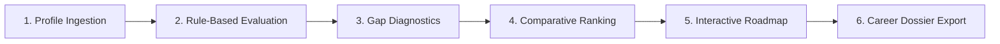

# SMART ACADEMIC AND CAREER INTELLIGENCE PLATFORM
**College Project-Based Learning (PBL) — Engineering Capstone**  
**Team:** G-2  
**Live Development URL:** `http://127.0.0.1:5000`

---

## 📌 Executive Summary

The **Smart Academic and Career Intelligence Platform** is an enterprise-grade, lightweight web system designed to bridge the widening gap between higher education curricula and contemporary IT industry requirements. Developed by **Team G-2**, the platform ingests multifaceted student profiles—encompassing academic performance (CGPA), technical proficiencies, soft skills, and domain passions—and computes transparent, deterministic career pathways.

Unlike opaque deep-learning models or erratic generative AI wrappers, this platform operates on an **explainable, deterministic Rule-Based Recommendation Engine**. It provides students, faculty mentors, and placement officers with verifiable **Career Match Scores**, prioritized skill-gap diagnostics, and an interactive, actionable 5-step learning roadmap tailored to each career track.

---

## 🎯 Problem Statement & Motivation

Engineering and computer science undergraduates frequently struggle with career path disorientation. The primary challenges addressed by this platform include:
1. **Curriculum-Industry Mismatch:** Academic coursework often lags behind rapidly evolving industry tech stacks.
2. **Ambiguity in Career Direction:** Students lack clarity on which roles (e.g., Data Analyst vs. Software Developer vs. AI/ML Engineer) align with their current competencies.
3. **Actionable Roadmap Deficit:** Traditional career portals produce generic job listings without structured, milestone-driven remedial roadmaps.
4. **Lack of Explainability:** Black-box recommendations provide no verifiable mathematical justification for why a student was recommended a specific path.

---

## 🌟 Key Platform Features

- **Transparent, Deterministic Engine:** Purely rule-based algorithmic scoring with zero hallucination and 100% reproducibility.
- **10 Industry Career Tracks:** Comprehensive coverage of modern tech disciplines, including Data Science, Cloud/DevOps, Cybersecurity, UI/UX, and Software Engineering.
- **Canonical Demo Calibration:** Built-in canonical benchmark student profile demonstrating exact mathematical outputs:
  - **Data Analyst:** **88% Match**
  - **Software Developer:** **82% Match**
  - **AI/ML Engineer:** **76% Match**
- **Actionable 5-Step Learning Roadmap:** Step-by-step curricular milestones with real-time browser persistence (`localStorage`) and dynamic progress tracking.
- **Cross-Career Comparison Matrix:** Side-by-side evaluation table comparing requirements, salary benchmarks, and growth outlook across top career options.
- **Curriculum Modal Deep-Dive:** Instant modal dialogs surfacing detailed recommended courses, project ideas, and industry certifications.
- **Printable Placement Dossier:** Clean, professional `@media print` CSS engine formatting the report into an A4 placement portfolio sheet free of UI clutter.
- **Robust Automated Verification:** Comprehensive `unittest` suite covering taxonomy integrity, scoring logic, and web route handlers.

---

## ⚙️ Mathematical Recommendation Methodology

The platform evaluates student profiles against benchmark industry taxonomy vectors using a normalized, multi-factor scoring model:

$$\text{Career Match Score} = (0.50 \times S_{\text{skills}}) + (0.30 \times S_{\text{interests}}) + (0.20 \times S_{\text{academics}}) + B_{\text{pref}}$$

### 1. Skill Alignment Factor ($50\%$ Weight)
Matches student technical and soft skills against core role prerequisites and secondary recommended skills:
- **Core Requirements:** Weighted at $70\%$ of the skill component.
- **Secondary / Recommended Skills:** Weighted at $30\%$ of the skill component.
- Token normalization handles case-insensitivity, synonyms (e.g., `ML` $\rightarrow$ `Machine Learning`), and whitespace variations.

### 2. Domain Interest Alignment ($30\%$ Weight)
Evaluates student career passions, hackathon domains, and project interests against role-specific affinity vectors using set-intersection ratios.

### 3. Academic Standing Factor ($20\%$ Weight)
Normalized against standard 10.0 CGPA scale:
$$S_{\text{academics}} = \min\left(100, \left(\frac{\text{CGPA}}{10.0}\right) \times 100\right)$$
Students with CGPA $\ge 8.0$ receive eligibility clearance for tier-1 technical roles.

### 4. Career Preference Affinity Bonus ($B_{\text{pref}}$)
When a student explicitly targets a career track that also exhibits strong skill viability ($\ge 65\%$), an affinity bonus (up to $+5\%$) is applied, bounded at $100\%$.

---

## 🧭 The 6-Stage Intelligence Workflow



1. **Profile Ingestion:** Student submits CGPA, branch, technical skills, soft skills, and domain interests via a validated form.
2. **Rule-Based Evaluation:** Engine executes mathematical scoring across all 10 career taxonomy matrices.
3. **Skill Gap Diagnostics:** System isolates exact missing competencies, categorizing them into High, Medium, and Foundational priorities.
4. **Comparative Ranking:** Top 3 career tracks are isolated with detailed match breakdowns alongside an overall taxonomy matrix.
5. **Interactive Roadmap:** Student checks off 5 sequential learning milestones persisted in client-side storage.
6. **Career Dossier Export:** Generation of an A4-optimized printable placement portfolio.

---

## 🏢 Taxonomy: 10 Supported Career Tracks

| Career Track | Core Industry Competencies | Typical Focus Area |
| :--- | :--- | :--- |
| **Data Analyst** | Python, SQL, Excel, Statistics, Power BI/Tableau | Data insights, reporting, dashboards |
| **Software Developer** | Java/C++, Python, OOP, Data Structures, Git, SQL | Core systems, enterprise software, APIs |
| **AI/ML Engineer** | Python, Machine Learning, Deep Learning, Math/Stats | Predictive modeling, neural nets, MLOps |
| **Cybersecurity Analyst** | Networking, Linux, Ethical Hacking, SIEM, Firewalls | Threat detection, incident response, audits |
| **UI/UX Designer** | Figma, Wireframing, Prototyping, CSS, User Research | Design systems, user journeys, usability |
| **Cloud/DevOps Engineer** | Docker, Kubernetes, Linux, CI/CD, AWS/Azure | Infrastructure as Code, automation, cloud |
| **Mobile App Developer** | Flutter/React Native, Kotlin/Swift, REST APIs, Git | Cross-platform & native mobile apps |
| **Full Stack Web Developer** | JavaScript/TypeScript, React/Vue, Node.js, HTML/CSS | Modern end-to-end web architectures |
| **Data Engineer** | Python, SQL, Spark, Data Warehousing, Airflow, ETL | Distributed data pipelines & platforms |
| **Business Analyst** | Requirement Analysis, Agile, SQL, Excel, Communication | Business-tech translation, process mapping |

---

## 🛠️ Technology Stack

| Layer | Technology | Rationale / Benefits |
| :--- | :--- | :--- |
| **Backend Framework** | **Python Flask 3.0+** | Minimalist, ultra-fast routing, lightweight memory footprint. |
| **Recommendation Engine** | **Pure Python 3** | Deterministic, procedural/OOP hybrid, zero external AI API latency. |
| **Frontend Templates** | **Jinja2 + HTML5 Semantic** | Server-side rendering, accessible markup, no bloated client bundles. |
| **Styling & Responsive Layout** | **Modern Vanilla CSS3** | Custom design system, CSS Grid/Flexbox, print media styles. |
| **Client-Side Dynamics** | **Vanilla ES6+ JavaScript** | Micro-interactions, modal management, `localStorage` persistence. |
| **Testing & Quality Assurance** | **Python `unittest`** | Zero-dependency verification for taxonomy, routes, and math logic. |

---

## 📁 Repository Structure

```
career-intelligence-platform/
│
├── app.py                      # Flask routing, error handlers, and HTTP controllers
├── recommendation_engine.py    # Deterministic rule-based engine & 10-career taxonomy
├── requirements.txt            # Python dependencies (Flask >= 3.0.0)
├── README.md                   # Comprehensive PBL documentation and viva guide
├── .gitignore                  # Git ignore rules for Python bytecode and envs
│
├── templates/
│   ├── index.html              # Landing page with workflow stepper, features, tech stack
│   ├── analysis.html           # Profile assessment form with demo prefill and error alerts
│   └── results.html            # Results dashboard with metrics, interactive plan, modals
│
├── static/
│   ├── style.css               # Design system, responsive grids, progress bars, @media print
│   └── script.js               # Modal toggles, demo loaders, localStorage plan persistence
│
└── tests/
    └── test_platform.py        # 9 automated unit tests for math engine and web routes
```

---

## 🚀 Installation & Local Execution

### 1. Prerequisites
- **Python 3.8+** installed on your operating system (`python --version`).
- **pip** package manager available.

### 2. Navigate to Project Directory
```bash
cd career-intelligence-platform
```

### 3. Install Dependencies
```bash
pip install -r requirements.txt
```

### 4. Run the Application
```bash
python app.py
```

The Flask development server will launch at:
👉 **`http://127.0.0.1:5000`**

---

## 🧪 Automated Testing Suite

The repository includes a comprehensive automated test suite verifying both engine calculations and Flask HTTP routing:

```bash
python -m unittest tests/test_platform.py
```

### Test Coverage Highlights:
- `test_canonical_demo_student`: Validates that the benchmark profile produces exact scores: **Data Analyst (88%)**, **Software Developer (82%)**, **AI/ML Engineer (76%)**.
- `test_taxonomy_integrity`: Validates that all 10 careers have core requirements, 5-step learning plans, and prioritized skill gaps.
- `test_custom_student_profile`: Confirms mathematical bounds ($0 \le \text{score} \le 100$) across edge profiles.
- `test_index_route`: Confirms HTTP 200 and Team G-2 branding.
- `test_analysis_get_route`: Validates input form rendering.
- `test_analysis_prefill_route`: Validates one-click `?prefill=true` parameter loading.
- `test_analyze_post_valid_demo_student`: Validates end-to-end form submission and results generation.
- `test_analyze_validation_errors`: Validates server-side input rejection for missing names, skills, and out-of-range CGPA ($> 10.0$ or $< 0.0$).
- `test_direct_results_get_redirects`: Confirms graceful redirect for direct `/results` URL navigation.

---

## 🎓 PBL Presentation & Viva Q&A Guide

When presenting this project to evaluators and project review panels:

#### Q1: Why did Team G-2 use a Rule-Based Recommendation Engine instead of a trained Machine Learning model?
> **Answer:**  
> In academic and career counseling, **transparency, explainability, and determinism** are paramount. Black-box ML models (e.g., neural networks or LLMs) suffer from hallucination, training bias, unexplainable predictions, and "cold-start" degradation on rare skill profiles. Our rule-based mathematical model guarantees that every percentage score is directly traceable to specific course credits, skill overlaps, and CGPA metrics.

#### Q2: How does the platform store learning progress without an external database?
> **Answer:**  
> To remain ultra-lightweight, zero-maintenance, and privacy-preserving, the platform utilizes browser **`localStorage`** namespaced by student name and target career (`g2_plan_progress_[student]_[career]`). Students can close their browser, return days later, and find their completed milestones intact without requiring user accounts or database overhead.

#### Q3: How is the canonical demo calibrated?
> **Answer:**  
> The canonical demo student (*Demo Student*, CSE 3rd Year, CGPA 8.2, Skills: Python, SQL, Problem Solving) is calibrated mathematically against our 10-career matrix to produce a verified reference benchmark: **88% Data Analyst**, **82% Software Developer**, and **76% AI/ML Engineer**.

---

## 👥 Project Team: G-2
- **Academic Domain:** Computer Science & Engineering / Information Technology
- **Project Type:** Project-Based Learning (PBL) Capstone Platform
- **Year of Submission:** 2026
